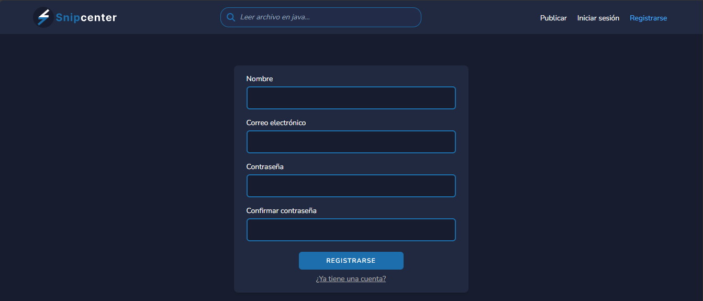

# Snipcenter

Snipcenter is a web application where developers can find and share code snippets for specific functionalities. It's designed as a community-driven platform where users can:

* Post and tag code snippets
* Search and filter snippets by tags
* Vote snippets up or down
* Comment and discuss snippets
* Register/login to participate

## Features

*  Search for code snippets
*  Browse snippets by tags
*  Post new code snippets with tags
*  Vote on snippets (approve/disapprove)
*  Comment on snippets
*  Authentication (login, register)

## Installation

### Stack

* Laravel
* Laravel Breeze
* TailwindCSS

### Requirements

* PHP 8.1
* Composer
* NPM
* Node.js

### Setup

```
# Clone the repository
git clone https://github.com/hugoruiz00/snipcenter.git

# Navigate into project folder
cd snipcenter

# Install PHP dependencies
composer install

# Install Node dependencies
npm install
```

### Environment Setup

```
# Copy example environment file
cp .env.example .env

# Generate application key
php artisan key:generate
```

Update your `.env` file with database credentials:

```
DB_CONNECTION=mysql
DB_HOST=127.0.0.1
DB_PORT=3306
DB_DATABASE=your_database_name
DB_USERNAME=your_username
DB_PASSWORD=your_password
```

### Database & Storage

```
# Run migrations with seeders
php artisan migrate --seed

# Create storage symlink
php artisan storage:link
```

### Running the Application

```
# Start Laravel server
php artisan serve

# Run Vite dev server
npm run dev
```

Then visit:
http://127.0.0.1:8000

## License

This project is licensed under the MIT License - see the [LICENSE](LICENSE) file for details.

### Screenshots

##### Home page - List of snippets


##### Search by tag


##### Login


##### Register


##### Post a new snippet


##### View snippet

